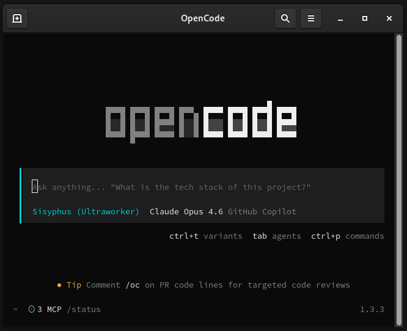
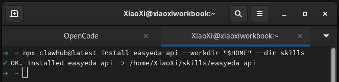
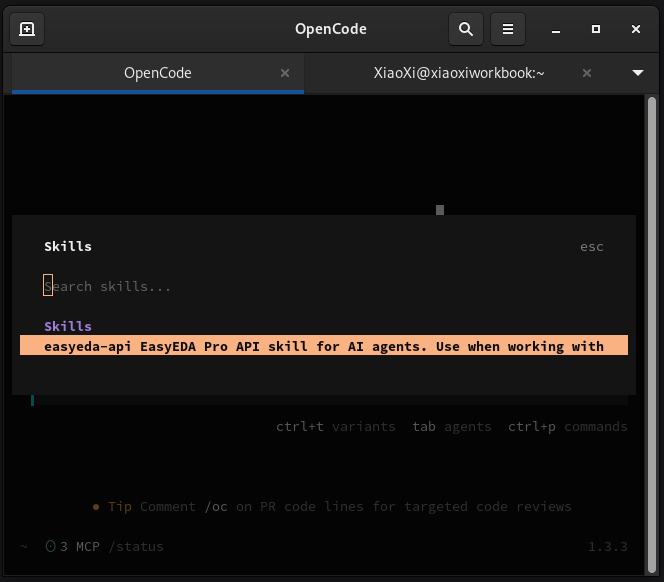
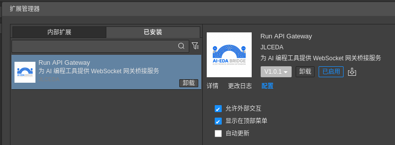
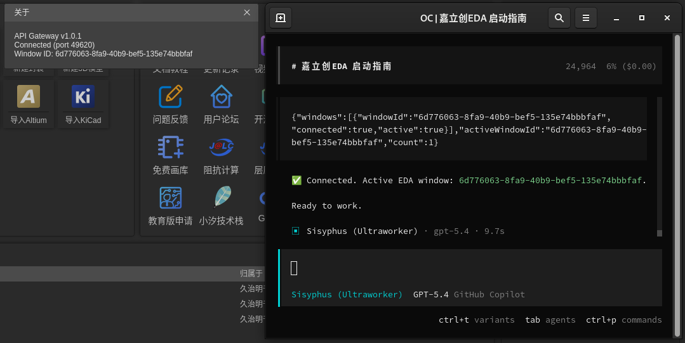

# Run API Gateway — FAQ & Advanced Usage

[English](./README.en.md) · [简体中文](./README.md) · [FAQ 简体中文](./FAQ.md)

This document is for users who hit problems or want a deeper understanding. It contains the full from-scratch tutorial, troubleshooting flow, component responsibilities, prompt examples, and developer-mode instructions.

If you only need the shortest path, jump back to [README.md](./README.md) → "Quick Start".

## Table of Contents

- [From-Scratch Tutorial](#from-scratch-tutorial)
  - [0. What You Will End Up With](#0-what-you-will-end-up-with)
  - [1. Prerequisites](#1-prerequisites)
  - [2. Install Node.js](#2-install-nodejs)
  - [3. Install OpenCode](#3-install-opencode)
  - [4. First Launch and Model Setup](#4-first-launch-and-model-setup)
  - [5. Install the EasyEDA API Skill](#5-install-the-easyeda-api-skill)
  - [6. Install This Extension in EasyEDA Pro](#6-install-this-extension-in-easyeda-pro)
  - [7. Open EDA and Wait for the Extension](#7-open-eda-and-wait-for-the-extension)
  - [8. Send the Start Command from OpenCode](#8-send-the-start-command-from-opencode)
  - [9. Verify That EDA Is Really Reachable](#9-verify-that-eda-is-really-reachable)
  - [10. Recommended Newbie Sequence (Copy-Paste Friendly)](#10-recommended-newbie-sequence-copy-paste-friendly)
- [Troubleshooting Connection Failures](#troubleshooting-connection-failures)
- [Copy-Paste Prompt Examples](#copy-paste-prompt-examples)
- [What Each Component Does](#what-each-component-does)
- [Developer Local Debug Mode](#developer-local-debug-mode)
- [Local Build & Development](#local-build--development)

---

## From-Scratch Tutorial

This section is written from the perspective of "first-time setup on a fresh machine". Follow the steps in order to let OpenCode call the EasyEDA Pro APIs through this extension.

### 0. What You Will End Up With

After completing this document you will be able to:

1. Install and verify **Node.js** on your machine.
2. Install and run **OpenCode**.
3. Install the **easyeda-api** Skill inside OpenCode.
4. Install and enable the **Run API Gateway** extension in EasyEDA Pro.
5. Have the AI connect to the running EDA window.
6. Have the AI directly call EDA APIs — e.g. reading current project info or window state.

### 1. Prerequisites

Before you start, please confirm:

- This tutorial assumes you are on **Windows 10** or **Windows 11**. If your Windows version is older, please upgrade first.
- To check your Windows version, press **Win**, type `winver`, and hit Enter.
- You are already familiar with EasyEDA Pro basics.
- Your machine has internet access (for installing dependencies and downloading tools).
- You can prepare an AI provider account or API key, or simply use one of OpenCode's free models for a first try.
- Installing **Node.js 22 LTS** or higher is recommended for best OpenCode/tooling compatibility.
- Many advanced features in this tutorial depend on model capability. If you want to test complex reasoning, planning, code generation, and long API call chains, prefer a model with strong overall benchmark scores.

### 2. Install Node.js

Both OpenCode and the Skill installer depend on Node.js, so this is step one.

> TIP
>
> On Windows, if you do not know how to open a terminal, press **Win**, type `PowerShell`, and open **Windows PowerShell** or **PowerShell**. It usually opens in your user directory, which is exactly what we want for the rest of the commands.

#### 2.1 Download and Install

Download **Node.js 22 LTS** or higher from the official site: <https://nodejs.org/en/download>

> TIP
>
> If you are comfortable with system package managers, you can install via that route. For most first-timers, the official installer is the simplest option.

#### 2.2 Verify the Installation

Open a terminal and run:

```bash
node -v
npm -v
```

If you see version numbers such as `v22.x.x` or `v24.x.x`, Node.js is installed successfully.


#### 2.3 Common Issues

- If you see `command not found`, you usually just need to open a fresh terminal.
- If you have multiple Node versions installed, make sure the terminal is using the newer one.
- On Windows, you may need to restart the terminal or even reboot after install.

### 3. Install OpenCode

The recommended way is through **npm**. Run in a terminal:

```bash
npm install -g opencode-ai
```

Then verify:

```bash
opencode --version
```

A valid version number means OpenCode is installed.


> TIP
>
> On macOS / Linux, you can also use the official install script:
>
> ```bash
> curl -fsSL https://opencode.ai/install | bash
> ```

### 4. First Launch and Model Setup

For new users, we recommend starting OpenCode directly from your user directory — don't overthink the "working directory" question yet.

- On Windows, opening **PowerShell** usually lands you in the user directory.
- On macOS / Linux, opening the terminal usually does the same.

So just run:

```bash
opencode
```



On first use, complete these initialization steps:

1. If you have a model provider subscription, run `/connect` inside OpenCode. Otherwise skip to step 5.
2. Pick the model provider you want to use.
  
3. Log in or paste your own API key when prompted.
4. Once you see the "connected" confirmation, return to the main view.
5. Run `/models` inside OpenCode to switch models (you can pick a free model or one of your paid subscriptions).
  

If you skip this step, even with the Skill and extension installed, OpenCode cannot actually call EDA.

> TIP
>
> Free models are great for first impressions, but the more advanced capabilities in this tutorial — complex instruction understanding, multi-step planning, long call chains, result summarization — depend heavily on model quality. For a stable end-to-end test, prefer a model with strong overall benchmark scores.

### 5. Install the EasyEDA API Skill

This extension only handles "let EDA join the bridge network". The Skill is what actually starts the Bridge Server, supplies the EasyEDA API documentation, and instructs the AI how to call it.

To make it available to every project, install the Skill into OpenCode's global Skill directory.

OpenCode scans the following common paths:

- `~/.agents/skills/`
- `~/.config/opencode/skills/`

We recommend `~/.config/opencode/skills/`.

#### 5.1 One-Line Install via ClawHub

For most users, just run the command matching your OS and shell:

If you are on **Windows** and have been following this guide using **PowerShell**, only run the **Windows PowerShell** command below — skip the **Windows cmd** one.

**Windows PowerShell**

```powershell
npx clawhub@latest install easyeda-api --workdir "$HOME/.config/opencode" --dir skills
```

**Windows cmd**

```bat
npx clawhub@latest install easyeda-api --workdir "%USERPROFILE%\.config\opencode" --dir skills
```

**macOS / Linux**

```bash
npx clawhub@latest install easyeda-api --workdir "$HOME/.config/opencode" --dir skills
```

What the flags mean:

- `--workdir ...`: pin the install location to OpenCode's global config directory.
- `--dir skills`: drop the Skill into the `skills/` folder that OpenCode scans automatically.

After it finishes, the target path is usually:

- Windows PowerShell: `$HOME/.config/opencode/skills/easyeda-api`
- Windows cmd: `%USERPROFILE%\.config\opencode\skills\easyeda-api`
- macOS / Linux: `~/.config/opencode/skills/easyeda-api`



#### 5.2 Manual Install (If the Command Fails)

If you hit network restrictions, can't run `npx`, or `clawhub` simply won't work, you can also install the Skill manually by downloading a zip and dropping it into the right folder.

Direct download link:

- <https://image.lceda.cn/files/easyeda-api.zip>

Manual install steps:

1. Download `easyeda-api.zip` from the link above.
2. Locate (or create) the `skills` folder inside OpenCode's global Skill directory.
3. Inside `skills`, create a folder named `easyeda-api`.
4. Unzip `easyeda-api.zip` directly into that `easyeda-api` folder.
5. Confirm the structure afterwards.

Recommended target paths:

- Windows: `%USERPROFILE%\.config\opencode\skills\easyeda-api`
- macOS / Linux: `~/.config/opencode/skills/easyeda-api`

After unzipping, the `easyeda-api` folder should contain:

- `SKILL.md`
- `package.json`
- `guide/`
- `references/`
- `user-guide/`

Important: do not end up with extra nested directories.

- Correct: `~/.config/opencode/skills/easyeda-api/SKILL.md`
- Wrong: `~/.config/opencode/skills/easyeda-api/easyeda-api/SKILL.md`

#### 5.3 After Install

After installing, restart OpenCode (or let it re-scan the environment).

If you plan to use OpenCode inside a specific project (e.g. the `pro-api-sdk` repo), you can still run:

```text
/init
```

inside the project. This bootstraps project context, but it is not a prerequisite for EDA connection.

Confirm the Skill is recognized with `/skills`:



### 6. Install This Extension in EasyEDA Pro

Now install the **Run API Gateway** extension on the EDA side.

Extension URL:

- <https://ext.lceda.cn/item/oshwhub/run-api-gateway>

After install, open EasyEDA's Extension Manager, find **Run API Gateway**, and ensure these options are enabled:

- **Allow External Interaction**
- **Show in Top Menu**



After enabling, confirm the **API Gateway** menu appears at the top.

If you see all four menu items, the extension has loaded:

- **Reconnect**
- **Stop Connection**
- **Toggle Auto-Connect Status**
- **About...**

### 7. Open EDA and Wait for the Extension

As long as EasyEDA Pro is running and the extension is loaded, the connection can be established.

The extension auto-scans ports `49620-49629` looking for the Bridge Server started by the Skill. Once the Bridge Server is up, the extension will try to connect automatically.

You don't need to fill in any IP or port manually — the default flow takes care of that.

> TIP
>
> If EDA was already open and you didn't see a connection, or it failed after 5 retries, you can trigger a manual reconnect via:
>
> - **API Gateway** → **Reconnect**


### 8. Send the Start Command from OpenCode

Return to OpenCode and type:

```text
EasyEDA, start!
```

Or, more explicitly:

```text
Please use the easyeda-api Skill to connect to the currently open EasyEDA Pro window and report the connection status.
```

OpenCode will then:

1. Read the **easyeda-api** Skill workflow.
2. Start or check the Bridge Server.
3. Probe `/health` for service status.
4. Complete the handshake with the **Run API Gateway** extension on the EDA side.
5. Prepare to execute subsequent API calls.

If everything works, you should see something like:

- Bridge Server started
- EDA client found
- Bridge connected
- Ready to execute API calls
- Connected
- Ready to work




### 9. Verify That EDA Is Really Reachable

Once connected, resist the urge to immediately do something complex — start with the simplest possible verification.

You can ask OpenCode something like:

```text
Please first check whether the current EasyEDA window is connected, and report the current window state, current editor type, and whether any project is open.
```

Or:

```text
Please perform a read-only verification: even if no project is currently open, tell me whether this EDA environment is now ready to receive API calls.
```

If it works, OpenCode will return real data from EDA, not just a generic explanation.

That confirms the full pipeline is up:

**OpenCode** → **easyeda-api Skill** → **Bridge Server** → **Run API Gateway** → **EasyEDA Pro**

### 10. Recommended Newbie Sequence (Copy-Paste Friendly)

If you want a strict step-by-step, run the following in order:

If you are on **Windows** and have been following this guide with **PowerShell**, prefer the **Windows PowerShell** commands below. Only use the **Windows cmd** variants if you are explicitly using cmd.

```bash
# 1) Install & verify Node.js
node -v
npm -v

# 2) Install OpenCode
npm install -g opencode-ai
opencode --version

# 3) Install the easyeda-api Skill into OpenCode's global Skill directory
# Windows PowerShell
npx clawhub@latest install easyeda-api --workdir "$HOME/.config/opencode" --dir skills

# Windows cmd
npx clawhub@latest install easyeda-api --workdir "%USERPROFILE%\.config\opencode" --dir skills

# macOS / Linux
npx clawhub@latest install easyeda-api --workdir "$HOME/.config/opencode" --dir skills

# 4) Start OpenCode
opencode
```

Inside OpenCode, complete the following in order:

1. Run `/connect` to set up a model provider, or simply pick a free model.
2. Optionally run `/init` inside your project.
3. Open EasyEDA Pro and make sure **Run API Gateway** is installed.
4. In the Extension Manager, confirm **Allow External Interaction** and **Show in Top Menu** are enabled.
5. Inside OpenCode, type: `EasyEDA, start!`
6. Once connected, ask the AI to perform a simple read-only API call as a sanity check.

---

## Troubleshooting Connection Failures

If you have followed all the steps but still can't connect, work through this checklist in order:

### Check OpenCode

```bash
opencode --version
```

If this fails, go back to [Step 3](#3-install-opencode) and reinstall.

### Check the Skill

Inside OpenCode, run:

```text
/skills
```

Verify **easyeda-api** shows up in the list.

- If it does, the Skill is installed correctly.
- If it doesn't, retry the matching install command:

If you are on **Windows** and have been using **PowerShell**, prefer the **Windows PowerShell** command below.

```powershell
# Windows PowerShell
npx clawhub@latest install easyeda-api --workdir "$HOME/.config/opencode" --dir skills

# Windows cmd
npx clawhub@latest install easyeda-api --workdir "%USERPROFILE%\.config\opencode" --dir skills

# macOS / Linux
npx clawhub@latest install easyeda-api --workdir "$HOME/.config/opencode" --dir skills
```

If the command still fails, fall back to the manual install in [5.2 Manual Install](#52-manual-install-if-the-command-fails).

If the installer errors out, the cause is usually Node.js, network, or npm permission related.

### Check the EDA Extension

Confirm the **API Gateway** menu appears in EasyEDA, and confirm both **Allow External Interaction** and **Show in Top Menu** are enabled in the Extension Manager. If the menu is missing, the extension is not actually running.

### Check EDA Is Open

You don't need to open a project, but EasyEDA itself must be running with the extension loaded.

### Manual Reconnect

In the EDA top menu, click:

- **API Gateway** → **Reconnect**

Then return to OpenCode and retry:

```text
Please reconnect to EasyEDA and report the current bridge status.
```

### Full Restart

If nothing else works, the most reliable recovery is a full restart in this order:

1. Quit OpenCode.
2. Quit EasyEDA Pro.
3. Reopen EasyEDA Pro and confirm the extension has loaded.
4. Return to your user directory (or whichever directory you normally use) and run `opencode` again.
5. Issue the connect command again.

### Network & Proxy Issues

If your machine has to go through a proxy to reach the internet, both `npx clawhub@latest install` and `opencode-ai` itself can be affected. Typical symptoms:

- `clawhub` hangs on the download step.
- OpenCode starts but cannot reach any model.

Mitigations:

- Windows: confirm the proxy is enabled in **Settings → Network & Internet → Proxy**.
- The shell needs to inherit (or be told about) the system proxy — you can also set `HTTP_PROXY` / `HTTPS_PROXY` explicitly.
- Some corporate networks intercept `ws://127.0.0.1` handshakes. If EDA shows `Handshake failed: unexpected service`, some other process on 127.0.0.1 is being mistaken for the Bridge. Close any other program occupying ports 49620-49629 and retry.

### Port Conflicts

If ports `49620-49629` are already in use by other software (common offenders: IDE Live Share, debug proxies, other local services), the extension will keep failing to find the Bridge Server.

Diagnostic commands:

```bash
# Windows PowerShell
Get-NetTCPConnection -LocalPort 49620,49621,49622,49623,49624,49625,49626,49627,49628,49629 -State Listen

# Windows cmd
netstat -ano | findstr :4962

# macOS / Linux
lsof -iTCP:49620-49629 -sTCP:LISTEN
```

If you find an unexpected occupant, close it and click **API Gateway** → **Reconnect** in EDA.

---

## Copy-Paste Prompt Examples

These are good for the first verification right after install:

```text
Please use the easyeda-api Skill to connect to the currently open EasyEDA Pro window and tell me whether the connection succeeded.
```

```text
If already connected, please report the current EDA window state, current editor type, and whether any project is open.
```

```text
Please do a read-only check first, without modifying the project, to confirm whether my EDA environment is ready to accept API calls.
```

```text
Please list the EasyEDA-related capabilities you currently have access to, and tell me what I can do next.
```

For more structured exploration, try:

```text
Please use the easyeda-api Skill to list all currently open documents and canvases in EDA.
```

```text
Please find all unconnected traces in the current PCB project and return the result as a table.
```

---

## What Each Component Does

To avoid confusion, here is the responsibility of each component:

- **Node.js** — Provides the runtime so OpenCode and its tooling can execute.
- **OpenCode** — Your entry point for interacting with the AI.
- **easyeda-api Skill** — Tells the AI how to connect to and call EDA, and runs the Bridge Server workflow.
- **Run API Gateway extension** — Lives inside EasyEDA and is responsible for receiving bridged requests and executing code.
- **EasyEDA Pro** — The actual target program being operated on.

Once you understand the split, debugging becomes much easier:

- OpenCode not installed → AI cannot even start.
- Skill not installed → AI does not know how to talk to EDA.
- Extension not installed → EDA cannot accept requests.
- EDA not running → even with a working bridge, there is nothing to operate on.

---

## Developer Local Debug Mode

If you are not an end user but a developer debugging the `easyeda-api-skill` repo locally, you can also start the Bridge Server manually:

```bash
cd /path/to/easyeda-api-skill
npm install
npm run server
```

The server will auto-pick an available port in `49620-49629`. Then open EasyEDA and make sure this extension is loaded — you are now in local dev mode.

For most users, however, the standard flow (OpenCode + **easyeda-api** Skill auto-connect) is still recommended.

---

## Local Build & Development

```bash
# Install dependencies
npm install

# Build the extension package
npm run build
```

After building, the `.eext` package lands in `./build/dist/` and can be installed into EasyEDA Pro.

For more commands and coding conventions, see [AGENTS.md](./AGENTS.md) at the repo root.
